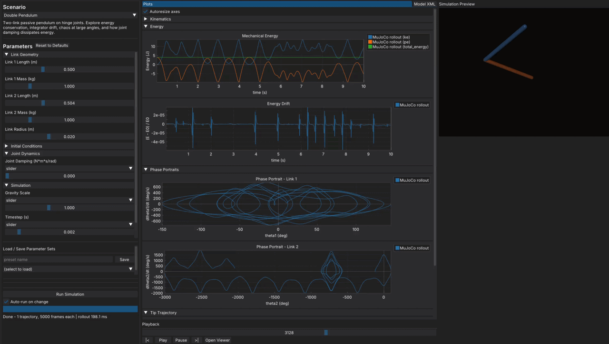
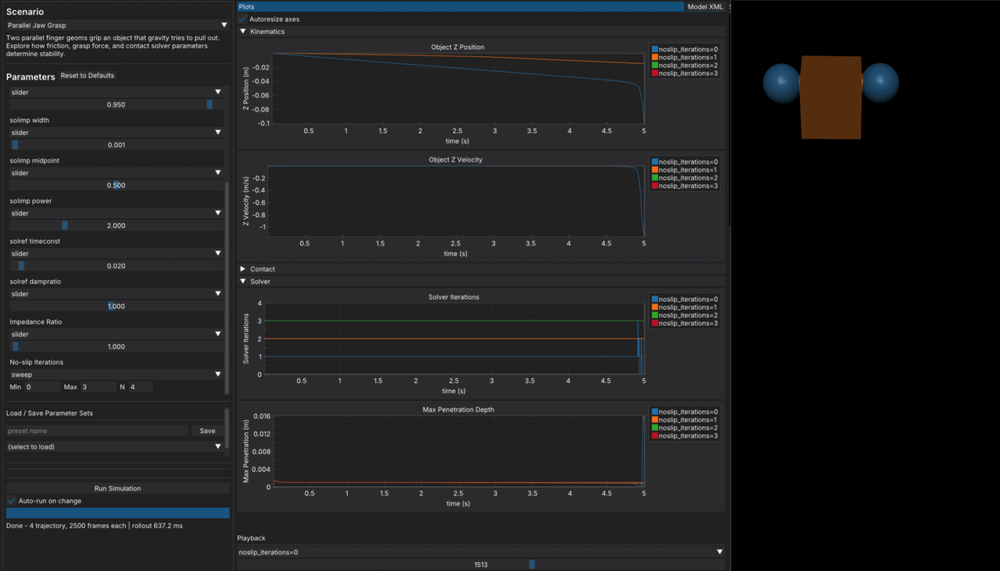
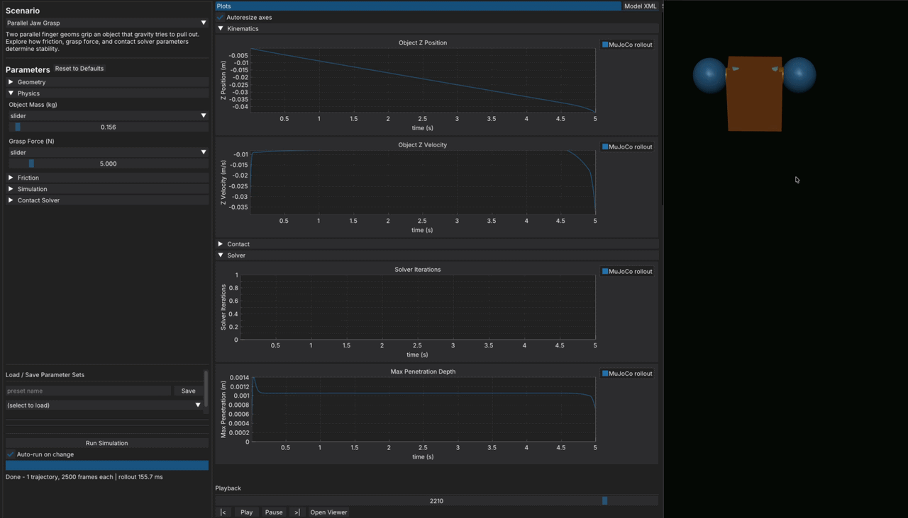

# MjGrok

An interactive sandbox for building deep intuition for MuJoCo's physics solver and its parameters.

## What it does

MjGrok hosts a collection of **canonical scenarios** — simple simulations designed to isolate and excite specific MuJoCo solver behaviors (friction, contacts, constraints, penetration, etc.). For each scenario you can:

- Tune solver parameters via an auto-generated GUI
- Run single simulations or sweep across a parameter range
- Overlay multiple trajectories in real-time plots
- Scrub, play, and pause a rendered playback of any run

The goal is to make MuJoCo's solver behavior tangible and explorable.

## Running

```bash
uv run python -m mjgrok
```

## How to Use

1. Select a scenario of interest from the dropdown. Note the description under the scenario gives an idea what that scenario is designed to explore.
2. Tune the parameters in real-time, immediately seeing the effect in the plots and viewer.

3. Switch from tuning a single param to sweeping over a range of values to visualize multiple trajectories in the plots.

4. Select the `Model XML` tab to see the live xml model produced by the current set of parameters.

5. Extend this framework by adding new custom scenarios that poke and prod at the things you're interested in (see below).


## Adding a Scenario

This framework is designed to be extensible. If you want to gain some intuition about a different MuJoCo scenario/parameters/solver, extending the behavior is simple:

1. Subclass `Scenario` in `src/mjgrok/scenarios/`
2. Implement `param_specs()`, `plot_specs()`, `build_model()`, and `extract_series()`
3. Register it in `scenarios/__init__.py`

The GUI adapts automatically — no other changes needed.

## Tech Stack

| Layer                | Library                          |
| -------------------- | -------------------------------- |
| GUI & plots          | DearPyGUI                        |
| Physics              | MuJoCo (CPU, offscreen renderer) |
| Package management   | uv                               |
| Linting / formatting | ruff                             |
